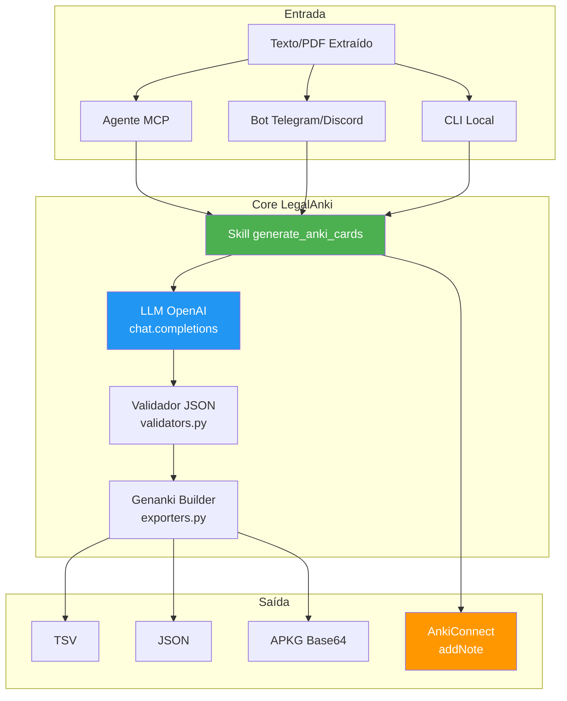
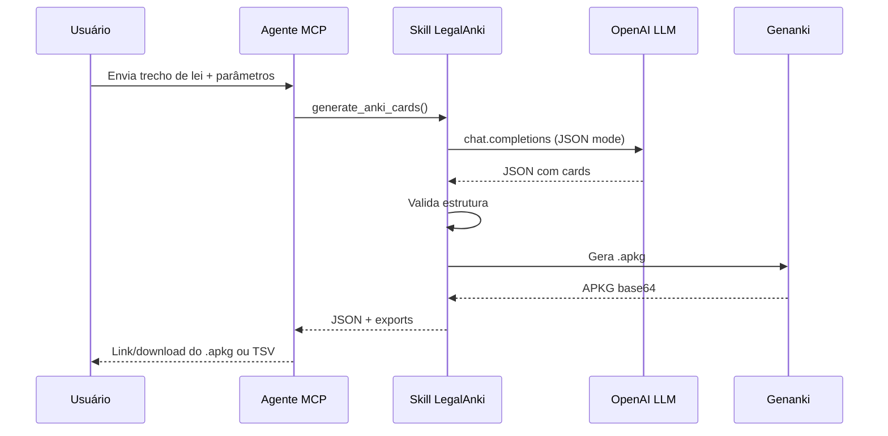

# LegalAnki - Documento de Requisitos de Produto (PRD)

| Campo              | Valor              |
| ------------------ | ------------------ |
| Versão             | 1.1.0              |
| Status             | Em Desenvolvimento |
| Responsável        | Gabriel Ramos      |
| Última atualização | 2026-02-08         |

## Histórico de Revisões

| Versão | Data       | Autor         | Descrição                                               |
| ------ | ---------- | ------------- | ------------------------------------------------------- |
| 1.0.0  | 2026-02-01 | Equipe        | Versão inicial do PRD                                   |
| 1.1.0  | 2026-02-08 | Gabriel Ramos | Adição de personas, user stories, roadmap e arquitetura |

---

## 1. Visão Geral do Produto

Skill/serviço que recebe conteúdo jurídico (leis, PDFs de aula, questões, jurisprudência) e gera automaticamente flashcards Anki otimizados para **Direito Constitucional para concursos**, com export em TSV, JSON e `.apkg`, além de opção de envio direto via AnkiConnect.

- **Público**: concurseiros (OAB, magistratura, MP, delegados), estudantes de Direito e professores.
- **Forma de uso**: embutido em agentes (Context7/MCP), bots (Discord/Telegram) ou scripts locais, recebendo texto e devolvendo cards prontos para Anki.

---

## 2. Personas

### Persona 1: Concurseiro Dedicado

| Atributo    | Detalhes                                           |
| ----------- | -------------------------------------------------- |
| Nome        | Maria, 28 anos                                     |
| Perfil      | Advogada preparando-se para Magistratura Estadual  |
| Dor         | Gasta 4h/dia criando flashcards manualmente        |
| Objetivo    | Automatizar criação de cards de qualidade jurídica |
| Dispositivo | MacBook + Anki Desktop                             |

### Persona 2: Professor de Cursinho

| Atributo    | Detalhes                                        |
| ----------- | ----------------------------------------------- |
| Nome        | Carlos, 45 anos                                 |
| Perfil      | Professor de Direito Constitucional em cursinho |
| Dor         | Preparar material personalizado para cada turma |
| Objetivo    | Gerar decks temáticos rapidamente para alunos   |
| Dispositivo | Windows + integração com plataforma do curso    |

### Persona 3: Estudante de Graduação

| Atributo    | Detalhes                                           |
| ----------- | -------------------------------------------------- |
| Nome        | João, 22 anos                                      |
| Perfil      | 5º período de Direito, primeira vez estudando Anki |
| Dor         | Fixar conteúdo extenso da CF/88 e jurisprudência   |
| Objetivo    | Cards simples para revisão diária no celular       |
| Dispositivo | AnkiDroid no smartphone                            |

---

## 3. Objetivos e Sucesso

### Objetivos Principais

- Automatizar a criação de cards Anki de alta qualidade, reduzindo tempo de preparação de material.
- Garantir cards atomizados, com fundamento legal explícito e, quando aplicável, jurisprudência recente do STF/STJ.
- Permitir criação em massa (dezenas/centenas) a partir de uma única fonte (aula, lei, caderno de questões).

### Métricas de Sucesso

| Métrica                                                  | Meta   |
| -------------------------------------------------------- | ------ |
| Cards aprovados pelo professor sem edição substancial    | ≥ 80%  |
| Tempo médio para gerar e importar deck de 50 cards       | ≤ 5min |
| Cards de jurisprudência com tese, tribunal e ano         | ≥ 90%  |
| Taxa de cards válidos (JSON válido, campos obrigatórios) | ≥ 95%  |

---

## 4. Escopo Funcional

### 4.1 Incluído (v1)

- Geração de cards a partir de texto bruto (leis, doutrina resumida, questões de concurso, súmulas, informativos).
- **Tipos de card**:
  - `basic` – pergunta e resposta diretas
  - `cloze` – conceitos, definições, artigos com lacunas
  - `jurisprudencia` – tese + tribunal + ano + referência
  - `questao_concurso` – enunciado, alternativa correta/comentário, fundamento, banca/ano
- Controle de **dificuldade** (`facil`, `medio`, `dificil`, `OAB`, `magistratura`) e **topic** (ex.: "controle de constitucionalidade").
- **Export**:
  - TSV (front, back, tags)
  - JSON (estrutura completa para logs/reprocessamento)
  - `.apkg` base64 via [genanki](https://github.com/kerrickstaley/genanki)
- Integração opcional com [AnkiConnect](https://git.sr.ht/~foosoft/anki-connect) (`addNote`) para enviar cards diretamente ao Anki Desktop.

### 4.2 Fora de Escopo (v1)

- Parsing nativo de PDFs/Word (espera-se texto já extraído pelo agente/ferramenta externa)
- Interface gráfica própria (web/app) – uso previsto via CLI, agente ou bot
- Gestão de espaçamento (scheduling) no lado da skill (delegado ao Anki)

---

## 5. User Stories

### US-001: Geração de Cards via Agente MCP

**Como** concurseiro
**Quero** gerar flashcards a partir de trechos de lei enviados ao agente
**Para** economizar tempo de estudo e manter cards padronizados

**Critérios de Aceitação:**

- [ ] Sistema aceita texto de até 10.000 caracteres
- [ ] Gera mínimo de 5 cards por requisição
- [ ] Cada card contém fundamento legal quando `include_legal_basis=true`
- [ ] Export em TSV, JSON e APKG disponível na resposta
- [ ] Retorno em ≤ 15 segundos para 20 cards

### US-002: Integração AnkiConnect

**Como** usuário avançado com Anki Desktop
**Quero** enviar cards diretamente ao meu Anki sem exportar arquivos
**Para** evitar importação manual e manter fluxo contínuo

**Critérios de Aceitação:**

- [ ] Detecta automaticamente se AnkiConnect está ativo (porta 8765)
- [ ] Cria deck automaticamente se não existir
- [ ] Mostra confirmação de quantos cards foram adicionados
- [ ] Erro amigável se Anki não estiver aberto

### US-003: Cards de Jurisprudência

**Como** candidato a magistratura
**Quero** cards focados em teses jurisprudenciais do STF/STJ
**Para** memorizar posicionamentos atualizados dos tribunais superiores

**Critérios de Aceitação:**

- [ ] Card contém: tese, tribunal, ano, ementa resumida
- [ ] Tag automática com tribunal e ano (ex.: `stf::2025`)
- [ ] Referência completa no campo extra
- [ ] ≥ 90% de aderência ao formato

### US-004: Geração via Bot Telegram

**Como** estudante que usa Telegram no dia a dia
**Quero** enviar texto/PDF ao bot e receber `.apkg` pronto
**Para** criar cards durante trajetos e intervalos

**Critérios de Aceitação:**

- [ ] Comando `/anki <tema> <dificuldade> <num_cards>`
- [ ] Bot extrai texto se necessário
- [ ] Retorna arquivo `.apkg` para download direto
- [ ] Mensagem de erro clara se falhar

---

## 6. Arquitetura do Sistema



### Componentes Principais

| Componente  | Arquivo           | Responsabilidade                            |
| ----------- | ----------------- | ------------------------------------------- |
| Generator   | `generator.py`    | Orquestra fluxo de geração de cards         |
| LLM Client  | `llm/`            | Comunica com OpenAI API                     |
| Validators  | `validators.py`   | Valida estrutura JSON e campos obrigatórios |
| Exporters   | `exporters.py`    | Gera TSV, JSON e APKG via genanki           |
| AnkiConnect | `anki_connect.py` | Integração com Anki Desktop                 |
| Models      | `models.py`       | Definição de dataclasses (Card, Deck, etc.) |
| Config      | `config.py`       | Configurações e variáveis de ambiente       |

---

## 7. Requisitos Detalhados

### 7.1 Entrada e Parâmetros

| Parâmetro             | Tipo                                                           | Descrição                                          |
| --------------------- | -------------------------------------------------------------- | -------------------------------------------------- |
| `content`             | `str`                                                          | Bloco de texto com o material de origem            |
| `card_type`           | `"basic" \| "cloze" \| "jurisprudencia" \| "questao_concurso"` | Tipo de card a gerar                               |
| `topic`               | `str`                                                          | Tema para tags e nome do deck                      |
| `difficulty`          | `"facil" \| "medio" \| "dificil" \| "OAB" \| "magistratura"`   | Nível de dificuldade                               |
| `num_cards`           | `int`                                                          | Quantidade-alvo de cards (5–50)                    |
| `include_legal_basis` | `bool`                                                         | Força inclusão de fundamento legal/jurisprudencial |

**Regras de comportamento:**

- Se `include_legal_basis=true`, cada card deve conter pelo menos um fundamento legal (artigo, súmula, tese) no campo `back` ou `extra.fundamento`.
- `topic` e `difficulty` geram tags normalizadas (minúsculas, sem acentos e espaços).

### 7.2 Saída

Objeto JSON com:

```json
{
  "cards": [
    {
      "front": "Qual o prazo da ADI?",
      "back": "Não há prazo. Art. 103, CF/88. 📚",
      "tags": ["direito-constitucional", "controle-concentrado", "medio"],
      "extra": {
        "fundamento": "Art. 103, CF/88",
        "dificuldade": "medio"
      }
    }
  ],
  "exports": {
    "tsv": "front\tback\ttags\n...",
    "json": "{...}",
    "apkg": "UEsDBBQAAAAI..."
  },
  "metadata": {
    "total": 20,
    "deck_name": "Direito Constitucional - Controle de Constitucionalidade",
    "tags_used": ["direito-constitucional", "controle-concentrado"],
    "skill_version": "1.1.0",
    "llm_model": "gpt-4o-mini"
  }
}
```

### 7.3 Templates e Modelos Anki

| Modelo                   | Campos                                                    |
| ------------------------ | --------------------------------------------------------- |
| Questão Concurso Direito | Enunciado, Resposta, Fundamento, Banca (layout HTML/CSS)  |
| Jurisprudência           | Tese, Tribunal, Ano, Ementa_Resumida, Referencia_Completa |
| Cloze Constitucional     | Text (com sintaxe `{{c1::...}}`)                          |

- Mapeamento de `Card.extra` → campos do modelo sempre que o modelo tiver mais que `Front/Back`.

### 7.4 LLM / Prompt

- **Geração Estruturada**: Utiliza a funcionalidade de _Structured Outputs_ da OpenAI (`client.beta.chat.completions.parse`) para garantir que os cards sigam rigorosamente o esquema JSON definido em modelos Pydantic (`AnkiCard`), eliminando erros de parsing.
  - Regras de atomização (um conceito por card, respostas objetivas)
  - Ênfase em literalidade da CF/88 e jurisprudência atual STF/STJ
  - Exemplos de cards válidos (basic, cloze, jurisprudência, questão)

---

## 8. Requisitos Não Funcionais

| Categoria           | Requisito                                                                          |
| ------------------- | ---------------------------------------------------------------------------------- |
| **Performance**     | Gerar 20 cards em ≤ 15 segundos (rede estável, modelo remoto)                      |
| **Confiabilidade**  | Validação pós-LLM (campos obrigatórios, JSON válido, quantidade mínima) + fallback |
| **Observabilidade** | Logs de entradas (anonimizadas), parâmetros usados e contagem de tokens/custos     |
| **Extensibilidade** | Fácil inclusão de novos `card_type` e suporte a outras áreas do Direito            |
| **Segurança**       | Nenhuma persistência de conteúdo sensível; chaves de API via variáveis de ambiente |

---

## 9. Fluxos Principais de Uso

### Fluxo 1 – Professor/Concurseiro via Agente (Context7/MCP)



### Fluxo 2 – Integração AnkiConnect

1. Usuário executa script local com Anki aberto e AnkiConnect ativado.
2. Script chama `generate_cards`, obtém `cards`.
3. Para cada card, envia `addNote` para AnkiConnect com `deckName` e `modelName` apropriados.
4. Cards aparecem imediatamente no deck do Anki, sem precisar de import manual.

### Fluxo 3 – Bot Discord/Telegram

1. Usuário envia PDF/lei/questões para o bot com comando `/anki constitucional magistratura 30 cards`.
2. Bot extrai texto, chama skill, recebe `.apkg`.
3. Bot envia arquivo `.apkg` pronto para download.

---

## 10. Matriz de Priorização (MoSCoW)

### Must Have (Essencial para v1)

- [x] Geração de cards `basic` e `cloze`
- [x] Export JSON e TSV
- [x] Validação de estrutura JSON
- [x] Integração OpenAI com JSON mode
- [ ] Export APKG via genanki

### Should Have (Importante)

- [ ] Tipo `jurisprudencia` completo
- [ ] Tipo `questao_concurso`
- [ ] Integração AnkiConnect
- [ ] Tags normalizadas automáticas

### Could Have (Desejável)

- [ ] Métricas de qualidade dos cards
- [ ] Templates Anki personalizáveis
- [ ] Cache de prompts otimizados
- [ ] Suporte a múltiplos modelos LLM

### Won't Have (v1)

- Interface gráfica própria
- Parsing de PDF nativo
- Scheduling de revisões
- Sincronização com AnkiWeb

---

## 11. Roadmap

### Fase 1: MVP (v1.0) ✅

- [x] Geração de cards básicos e cloze
- [x] Export TSV e JSON
- [x] Integração OpenAI
- [x] Validação de estrutura JSON
- [x] Modelos de dados (dataclasses)

### Fase 2: Produção (v1.1) 🔄

- [ ] Geração de APKG via genanki
- [ ] Tipo jurisprudência completo
- [ ] Tipo questão de concurso
- [ ] Integração AnkiConnect
- [ ] Testes automatizados (pytest)

### Fase 3: Expansão (v2.0) 📋

- [ ] Suporte a Direito Administrativo
- [ ] Suporte a Direito Penal
- [ ] Templates personalizáveis
- [ ] Métricas de qualidade dos cards
- [ ] Dashboard de uso e custos

---

## 12. Restrições, Dependências e Riscos

### Dependências

| Dependência  | Tipo       | Impacto                                 |
| ------------ | ---------- | --------------------------------------- |
| OpenAI API   | Externa    | Latência, custos, limites de tokens     |
| genanki      | Biblioteca | Geração de arquivos APKG                |
| AnkiConnect  | Plugin     | Integração direta (opcional)            |
| Python 3.11+ | Runtime    | Compatibilidade de dataclasses e typing |

### Riscos e Mitigações

| Risco                                     | Probabilidade | Impacto | Mitigação                                                |
| ----------------------------------------- | ------------- | ------- | -------------------------------------------------------- |
| Mudança em modelos LLM afetando qualidade | Média         | Alto    | Exemplos no prompt + versionamento de prompts            |
| Alucinações de fundamentos legais         | Alta          | Médio   | Checks automáticos (regex "Art. X, CF") + revisão humana |
| Rate limits da OpenAI                     | Baixa         | Médio   | Retry com backoff exponencial                            |
| AnkiConnect indisponível                  | Baixa         | Baixo   | Fallback para export APKG                                |

---

## 13. Glossário

| Termo              | Definição                                                                |
| ------------------ | ------------------------------------------------------------------------ |
| **Card**           | Unidade de flashcard com frente (pergunta) e verso (resposta)            |
| **Cloze**          | Tipo de card com lacunas para preenchimento (ex: `{{c1::texto}}`)        |
| **Deck**           | Conjunto de cards agrupados por tema                                     |
| **APKG**           | Formato de pacote Anki para importação/exportação de decks               |
| **AnkiConnect**    | Plugin que expõe API REST para controle do Anki Desktop                  |
| **Genanki**        | Biblioteca Python para geração programática de arquivos APKG             |
| **MCP**            | Model Context Protocol – padrão para integração de skills com agentes IA |
| **Atomização**     | Princípio de criar cards com um único conceito por unidade               |
| **Jurisprudência** | Entendimento dos tribunais sobre determinada matéria                     |
| **Súmula**         | Enunciado que resume jurisprudência dominante de um tribunal             |

---

## 14. Referências

### Documentação Técnica

- [genanki - GitHub](https://github.com/kerrickstaley/genanki) – Biblioteca para geração de APKG
- [AnkiConnect - SourceHut](https://git.sr.ht/~foosoft/anki-connect) – Plugin de API REST para Anki
- [OpenAI Chat Completions - JSON Mode](https://community.openai.com/t/how-do-i-use-the-new-json-mode/475890) – Documentação do modo JSON

### Metodologia PRD

- [PRD Templates and Examples - AltexSoft](https://www.altexsoft.com/blog/product-requirements-document/)
- [Product Requirements Document - Product School](https://productschool.com/blog/product-strategy/product-template-requirements-document-prd)
- [Documento de Requisitos de Produto - Banani](https://www.banani.co/pt/blog/what-is-prd-product-requirements-document)
- [PRD Template - Inflectra](https://www.inflectra.com/Ideas/Topic/PRD-Template.aspx)
- [Template de PRD - Monday.com](https://monday.com/blog/pt/desenvolvimento/template-de-prd/)
