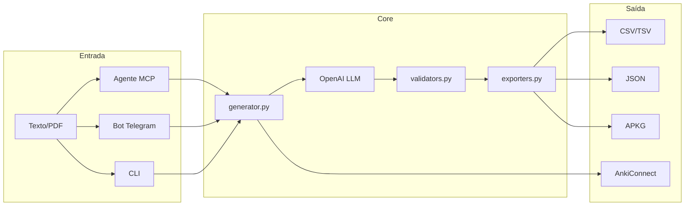

# LegalAnki 📚⚖️

<div align="center">

**Gerador inteligente de flashcards Anki para Direito Constitucional usando LLM**

[](https://www.python.org/downloads/)
[](https://github.com/psf/black)
[](LICENSE)

</div>

## Visão Geral

LegalAnki é uma skill/biblioteca Python que transforma conteúdo jurídico (leis, PDFs de aula, questões, jurisprudência) em flashcards Anki otimizados para **Direito Constitucional em concursos**.

### Principais Recursos

- 🤖 **Geração via LLM** – OpenAI GPT-4o com Structured Outputs
- 📝 **Múltiplos tipos de card** – Basic, Cloze, Questão de Concurso, Jurisprudência
- 📦 **Exports flexíveis** – CSV, TSV, JSON, APKG (`.apkg`)
- 🔗 **Integração AnkiConnect** – Envio direto para o Anki Desktop
- ⚡ **Validação automática** – Estrutura JSON e campos obrigatórios

---

## Quick Start

### 1. Instalação

```bash
# Clone o repositório
git clone https://github.com/gabrielramos/LegalAnki.git
cd LegalAnki

# Instale as dependências com uv
uv sync

# Ou com pip
pip install -e .
```

### 2. Configuração

Copie o arquivo de exemplo e configure sua API key:

```bash
cp .env.example .env
```

Edite `.env` com sua chave OpenAI:

```env
OPENAI_API_KEY=sk-...
```

### 3. Uso Básico

```python
from legal_anki.generator import generate_cards
from legal_anki.exporters import export_to_apkg

# Gerar cards a partir de texto
cards = generate_cards(
    text="Art. 5º, CF/88: Todos são iguais perante a lei...",
    topic="direitos_fundamentais",
    difficulty="medio",
    max_cards=5
)

# Exportar para APKG
export_to_apkg(cards, deck_name="Direito Constitucional", output_path="deck.apkg")
```

### 4. Via CLI

```bash
uv run python main.py
```

---

## Variáveis de Ambiente

| Variável                       | Obrigatória | Descrição                   | Exemplo                 |
| ------------------------------ | ----------- | --------------------------- | ----------------------- |
| `OPENAI_API_KEY`               | ✅          | Chave da API OpenAI         | `sk-...`                |
| `OPENAI_MODEL`                 | ❌          | Modelo a usar               | `gpt-4o-2024-08-06`     |
| `ANKI_DECK_ID`                 | ❌          | ID único do deck            | `1234567890`            |
| `ANKI_MODEL_BASIC_ID`          | ❌          | ID do modelo Basic          | `1234567891`            |
| `ANKI_MODEL_CLOZE_ID`          | ❌          | ID do modelo Cloze          | `1234567892`            |
| `ANKI_MODEL_QUESTAO_ID`        | ❌          | ID do modelo Questão        | `1234567893`            |
| `ANKI_MODEL_JURISPRUDENCIA_ID` | ❌          | ID do modelo Jurisprudência | `1234567894`            |
| `ANKI_CONNECT_URL`             | ❌          | URL do AnkiConnect          | `http://localhost:8765` |

> **Nota**: Os IDs Anki evitam conflitos entre perfis. Gere novos IDs com:
>
> ```bash
> python -c "import random; print(random.randrange(1 << 30, 1 << 31))"
> ```

---

## 📖 Exemplos de Uso

### Exemplo 1: Cards a partir de Artigo da CF/88

```python
from legal_anki.generator import generate_cards
from legal_anki.exporters import export_to_apkg

artigo = """
Art. 5º, LXIII - a plenitude da defesa;
Art. 5º, LXIV - o direito de informar, aos seus familiares e às
pessoas que lhe são próximas, sobre sua prisão ou detenção;
Art. 5º, LXV - a prisão de qualquer pessoa e o local onde se
encontre serão comunicados imediatamente ao juiz competente
e à família do preso ou à pessoa por ele indicada.
"""

cards = generate_cards(
    text=artigo,
    topic="garantias_processuais",
    difficulty="medio",
    card_type="cloze",
    max_cards=10
)

export_to_apkg(cards, "Garantias Processuais.apkg")
```

### Exemplo 2: Cards de Jurisprudência

```python
from legal_anki.generator import generate_cards
from legal_anki.exporters import export_to_csv

sumula = """
Súmula Vinculante 11 - STF: Só é lícito o uso de algemas em casos
de resistência e de fundado receio de fuga ou de perigo à
integridade física própria ou alheia, por parte do preso ou de
terceiros, devendo justificar a excepcionalidade por escrito.
"""

cards = generate_cards(
    text=sumula,
    topic="sumulas_vinculantes",
    difficulty="dificil",
    card_type="jurisprudencia"
)

# Exporta para CSV com cabeçalho
export_to_csv(cards, "sumulas.csv", include_header=True)
```

### Exemplo 3: Múltiplos Formatos

```python
from legal_anki.generator import generate_cards
from legal_anki.exporters import export_cards

cards = generate_cards(
    text="Art. 5º da CF/88...",
    topic="direitos_fundamentais"
)

# Exporta para todos os formatos
for fmt in ["csv", "json", "apkg"]:
    export_cards(
        cards=cards,
        output_path=f"direitos_fundamentais.{fmt}",
        format=fmt,
        deck_name="Direito Constitucional"  # apenas para APKG
    )
```

### Exemplo 4: Integração com AnkiConnect

```python
from legal_anki.anki_connect import AnkiConnectClient
from legal_anki.generator import generate_cards

client = AnkiConnectClient()

# Verifica se Anki está rodando
if client.is_available():
    cards = generate_cards(text=texto, topic="teste")

    # Adiciona cards ao deck
    for card in cards:
        note_id = client.add_card(
            card=card,
            deck_name="LegalAnki::Teste"
        )
        print(f"Card adicionado: {note_id}")

    # Sincroniza com AnkiWeb
    client.sync()
else:
    print("Abra o Anki com AnkiConnect instalado")
```

---

## Arquitetura



---

## Estrutura do Projeto

```text
LegalAnki/
├── src/legal_anki/
│   ├── generator.py      # Orquestra geração de cards
│   ├── models.py         # Modelos Anki (genanki)
│   ├── exporters.py      # CSV, TSV, JSON, APKG
│   ├── validators.py     # Validação de estrutura
│   ├── config.py         # Configurações
│   ├── anki_connect.py   # Integração AnkiConnect
│   ├── llm/              # Cliente OpenAI
│   └── prompts/          # System prompts
├── tests/                # Testes pytest
├── main.py               # Entry point CLI
└── PRD.md                # Documento de requisitos
```

---

## Tipos de Card

| Tipo             | Descrição                 | Campos                                                       |
| ---------------- | ------------------------- | ------------------------------------------------------------ |
| `basic`          | Pergunta/Resposta simples | Front, Back                                                  |
| `cloze`          | Lacunas para preencher    | Text, Extra                                                  |
| `questao`        | Questão de concurso       | Front, Back, Banca, Ano, Cargo, Fundamento                   |
| `jurisprudencia` | Súmulas e julgados        | Front, Back, Tribunal, DataJulgamento, Tema, FundamentoLegal |

---

## Formatos de Export

### CSV (Default)

Separador `;` para compatibilidade com Excel BR.

```csv
front;back;tags
"Qual o prazo da ADI?";"Não há prazo. Art. 103, CF/88";"controle-concentrado,medio"
```

### TSV

Compatível com importação direta no Anki.

### JSON

Estrutura completa com metadata para logs e reprocessamento.

### APKG

Pacote Anki pronto para importação via `genanki`.

---

## 🧪 Desenvolvimento

### Executando Testes

```bash
# Instale dependências de desenvolvimento
pip install -e ".[dev]"

# Execute os testes
pytest tests/ -v

# Com cobertura
pytest tests/ --cov=src/legal_anki --cov-report=html

# Teste específico
pytest tests/test_utils.py -v
```

### Formatação e Lint

```bash
# Black (formatação)
black src/ tests/

# isort (ordenação de imports)
isort src/ tests/

# ruff (lint rápido)
ruff check src/ tests/

# mypy (type checking)
mypy src/legal_anki/
```

### Estrutura de Testes

```text
tests/
├── conftest.py           # Fixtures compartilhadas
├── test_exporters.py     # Testes de exportação
├── test_llm_client.py    # Testes do cliente LLM
├── test_utils.py         # Testes de utilitários
└── test_validators.py    # Testes de validação
```

---

## 🤝 Contribuindo

Contribuições são bem-vindas! Por favor:

1. **Fork** o projeto
2. Crie uma **branch** para sua feature (`git checkout -b feature/nova-feature`)
3. **Commit** suas mudanças (`git commit -m 'Adiciona nova feature'`)
4. **Push** para a branch (`git push origin feature/nova-feature`)
5. Abra um **Pull Request**

### Diretrizes

- Siga PEP 8 para estilo de código
- Adicione testes para novas funcionalidades
- Atualize a documentação quando necessário
- Use docstrings Google style

---

## 📄 Licença

MIT License - veja [LICENSE](LICENSE) para detalhes.

---

## 🙋 Suporte

- 📧 Abra uma [issue](https://github.com/gabrielramos/LegalAnki/issues) para bugs ou sugestões
- 📖 Consulte o [PRD.md](PRD.md) para documentação detalhada dos requisitos
- 💬 Para discussões sobre Direito Constitucional, consulte materiais especializados

---

## 🎯 Sobre o Projeto

Desenvolvido com ❤️ para concurseiros de Direito Constitucional
